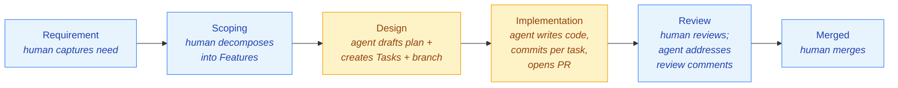

# ocs-testbench

[](#)
[](https://github.com/eddiecarpenter/ocs-testbench/releases)
[](https://sonarcloud.io/summary/new_code?id=eddiecarpenter_ocs-testbench)
[](https://github.com/eddiecarpenter/gh-agentic)
[](LICENSE)

> ⚠️ **Heavy development — not ready for use.** This project is being built in the open as a real-world dogfood of the [`gh-agentic`](https://github.com/eddiecarpenter/gh-agentic) delivery framework. APIs, schemas, scenario formats, persistence layout, and the UI are all in flux. Do not depend on it. Do not deploy it. Star it, watch it, read the PRs — but don't ship it.

> 📘 **For project context → [docs/PROJECT_BRIEF.md](docs/PROJECT_BRIEF.md)**
> 📐 **For the architectural baseline → [docs/ARCHITECTURE.md](docs/ARCHITECTURE.md)**

---

## What this is

The **OCS Testbench** is a Diameter Gy traffic generator and verifier for testing Online Charging Systems. It plays the role of a Charging Trigger Function (CTF), sending Credit-Control-Request messages to an OCS endpoint and verifying the Credit-Control-Answer responses against scenario-defined expectations.

It is a testing tool — it does **not** implement OCS or charging logic. It exists to exercise the OCS that does.

Two things ship in this repo:

1. **A Go backend** — Diameter Gy stack (built on `fiorix/go-diameter`), execution engine, AVP rendering engine, REST + SSE API, PostgreSQL persistence via `sqlc`.
2. **A React / TypeScript SPA** — scenario authoring, interactive step-through, continuous-run control, real-time response streaming. Embedded into the Go binary via `go:embed` for single-binary deployment.

Scenarios are self-contained AVP trees with placeholder substitution, ordered step lists, value extraction, guards and assertions evaluated through [`ruleevaluator`](https://github.com/eddiecarpenter/ruleevaluator), and configurable result-code handlers. The testbench supports multiple concurrent Diameter peers with independent identities, multi-MSCC sessions, multi-session subscribers, and both session-based (CCR-I/U/T) and event-based (CCR-E) charging.

---

## How it works

### Built with `gh-agentic`

This repo is a **downstream consumer of [`gh-agentic`](https://github.com/eddiecarpenter/gh-agentic)** — every Feature in the OCS Testbench is captured as a Requirement, scoped into Features, designed into ordered Tasks, implemented commit-per-task, and merged via the same label-driven pipeline the framework prescribes. The framework is mounted at [`.ai/`](.ai/) as a tracked submodule pinned to a version tag.



The merged-PR history on this repo is, in effect, a public log of agentic delivery against a real telecoms problem domain — Diameter, AVPs, multi-MSCC charging, the lot. If you want to see what `gh-agentic` produces under realistic conditions (rather than on a toy example), this is the place to look.

The framework's universal rules — reuse audits, contract discipline, AC-traceability, rationale-as-artefact, per-task commit format — apply to every change here. See [`AGENTS.md`](AGENTS.md) for the bootstrap rule and [`AGENTS.local.md`](AGENTS.local.md) for project-specific overrides.

### Key capabilities

- **Traffic generation** — session-based charging (CCR-I/U/T), event-based (CCR-E), service-agnostic AVP trees (SMS / USSD / VOICE / DATA / custom), multi-MSCC, multi-session.
- **Execution modes** — *interactive* step mode for manual control with mid-flight value editing; *continuous* mode for automated loops with configurable stop conditions.
- **Response handling** — protocol-mandated behaviour built-in (Final-Unit-Indication, Validity-Time, permanent failures); configurable handlers per result code; CCA value extraction into scenario context; guards and assertions via the expression evaluator; derived values fed back into subsequent requests.
- **Configuration** — runtime-configurable Diameter peers (no restart), multiple concurrent peer connections with independent identities, subscriber management (MSISDN / ICCID / IMEI), scenarios as ordered step lists with placeholder substitution.

### Technology stack

| Component | Technology |
|---|---|
| Backend | Go |
| Diameter | [`fiorix/go-diameter`](https://github.com/fiorix/go-diameter) |
| Expression evaluator | [`eddiecarpenter/ruleevaluator`](https://github.com/eddiecarpenter/ruleevaluator) |
| Frontend | React / TypeScript SPA |
| Persistence | PostgreSQL + `sqlc` |
| Real-time streaming | Server-Sent Events (SSE) |
| Packaging | Single binary (Go backend + embedded UI via `go:embed`) |
| Delivery | [`gh-agentic`](https://github.com/eddiecarpenter/gh-agentic) — agentic pipeline mounted at `.ai/` |

---

## Architecture at a glance

The application follows an API-first design — the core library (Diameter stack, execution engine, AVP rendering engine) has no HTTP dependency, with REST for CRUD and execution control, and SSE for real-time response streaming.

| Layer | Responsibility |
|---|---|
| **Core library** | Diameter Gy stack, execution engine, AVP rendering engine — no HTTP, no UI |
| **REST API** | Configuration CRUD, scenario authoring, execution control |
| **SSE stream** | Real-time delivery of responses, session state, connection status |
| **Web UI** | Scenario authoring, step-through, continuous-run control, dark mode |
| **Persistence** | PostgreSQL via `sqlc`-generated query interfaces |
| **Framework mount** (`.ai/`) | `gh-agentic` framework pinned to a version tag — skills, recipes, standards, RULEBOOK |

Full design context is in [`docs/ARCHITECTURE.md`](docs/ARCHITECTURE.md).

### Deployment modes

| Mode | Description |
|---|---|
| Local | Single binary, auto-opens browser |
| Docker | Container image |
| Kubernetes | Standard deployment + service |
| Headless | REST / SSE API only, no browser |

---

## Development

```bash
git clone --recurse-submodules git@github.com:eddiecarpenter/ocs-testbench.git
cd ocs-testbench
go build ./...
go test ./...
```

If you cloned without `--recurse-submodules`, populate the framework mount with:

```bash
git submodule update --init --recursive
```

For agent-driven development workflows, see [`AGENTS.md`](AGENTS.md) and the framework playbooks under [`.ai/skills/`](.ai/skills/).

---

## License

[MIT](LICENSE)
