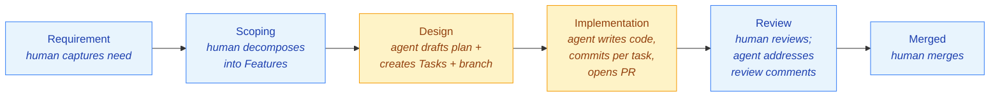

# ocs-testbench

[](#)
[](https://github.com/eddiecarpenter/ocs-testbench/releases)
[](https://sonarcloud.io/summary/new_code?id=eddiecarpenter_ocs-testbench)
[](https://github.com/eddiecarpenter/gh-agentic)
[](LICENSE)

> 🚀 **v1.0.0 released.** This project is built in the open as a real-world dogfood of the [`gh-agentic`](https://github.com/eddiecarpenter/gh-agentic) delivery framework — every feature lands through its agentic pipeline. It's ready to use; ongoing work continues in the open, so watch the releases and read the PRs to follow along.

> 📘 **For project context → [docs/PROJECT_BRIEF.md](docs/PROJECT_BRIEF.md)**
> 📐 **For the architectural baseline → [docs/ARCHITECTURE.md](docs/ARCHITECTURE.md)**

---

## What this is

The **OCS Testbench** is a Diameter Gy traffic generator and verifier for testing Online Charging Systems. It plays the role of a Charging Trigger Function (CTF), sending Credit-Control-Request messages to an OCS endpoint and verifying the Credit-Control-Answer responses against scenario-defined expectations.

It is a testing tool — it does **not** implement OCS or charging logic. It exists to exercise the OCS that does.

Two things ship in this repo:

1. **A Go backend** — Diameter Gy stack (built on `fiorix/go-diameter`), execution engine, AVP rendering engine, REST + SSE API, PostgreSQL persistence via `sqlc`.
2. **A React / TypeScript SPA** — scenario authoring, interactive step-through, continuous-run control, real-time response streaming. Embedded into the Go binary via `go:embed` for single-binary deployment.

Scenarios are self-contained AVP trees with placeholder substitution, ordered step lists, value extraction, guards and assertions evaluated through [`ruleevaluator`](https://github.com/eddiecarpenter/ruleevaluator), and configurable result-code handlers. The testbench supports multiple concurrent Diameter peers with independent identities, multi-MSCC sessions, multi-session subscribers, and both session-based (CCR-I/U/T) and event-based (CCR-E) charging.

---

## How it works

### Built with `gh-agentic`

This repo is a **downstream consumer of [`gh-agentic`](https://github.com/eddiecarpenter/gh-agentic)** — every Feature in the OCS Testbench is captured as a Requirement, scoped into Features, designed into ordered Tasks, implemented commit-per-task, and merged via the same label-driven pipeline the framework prescribes. The framework is mounted at [`.agents/`](.agents/) as a tracked submodule pinned to a version tag.

This repo is listed in [`gh-agentic`](https://github.com/eddiecarpenter/gh-agentic) as a reference example of the framework driving a real project — so the link runs both ways: gh-agentic points here as its worked example, and this README points back to gh-agentic as its delivery pipeline.


```mermaid
flowchart LR
    R[Requirement<br/><i>human captures need</i>] --> S[Scoping<br/><i>human decomposes<br/>into Features</i>]
    S --> D[Design<br/><i>agent drafts plan +<br/>creates Tasks + branch</i>]
    D --> I[Implementation<br/><i>agent writes code,<br/>commits per task,<br/>opens PR</i>]
    I --> V[Review<br/><i>human reviews;<br/>agent addresses<br/>review comments</i>]
    V --> M[Merged<br/><i>human merges</i>]

    classDef human fill:#e8f4fd,stroke:#3b82f6,color:#1e40af
    classDef agent fill:#fef3c7,stroke:#f59e0b,color:#92400e
    class R,S,V,M human
    class D,I agent
```

The merged-PR history on this repo is, in effect, a public log of agentic delivery against a real telecoms problem domain — Diameter, AVPs, multi-MSCC charging, the lot. If you want to see what `gh-agentic` produces under realistic conditions (rather than on a toy example), this is the place to look.

The framework's universal rules — reuse audits, contract discipline, AC-traceability, rationale-as-artefact, per-task commit format — apply to every change here. See [`AGENTS.md`](AGENTS.md) for the bootstrap rule and [`AGENTS.local.md`](AGENTS.local.md) for project-specific overrides.

### Key capabilities

- **Traffic generation** — session-based charging (CCR-I/U/T), event-based (CCR-E), service-agnostic AVP trees (SMS / USSD / VOICE / DATA / custom), multi-MSCC, multi-session.
- **Execution modes** — *interactive* step mode for manual control with mid-flight value editing; *continuous* mode for automated loops with configurable stop conditions.
- **Response handling** — protocol-mandated behaviour built-in (Final-Unit-Indication, Validity-Time, permanent failures); configurable handlers per result code; CCA value extraction into scenario context; guards and assertions via the expression evaluator; derived values fed back into subsequent requests.
- **Configuration** — runtime-configurable Diameter peers (no restart), multiple concurrent peer connections with independent identities, subscriber management (MSISDN / ICCID / IMEI), scenarios as ordered step lists with placeholder substitution.

### Technology stack

| Component | Technology |
|---|---|
| Backend | Go |
| Diameter | [`fiorix/go-diameter`](https://github.com/fiorix/go-diameter) |
| Expression evaluator | [`eddiecarpenter/ruleevaluator`](https://github.com/eddiecarpenter/ruleevaluator) |
| Frontend | React / TypeScript SPA |
| Persistence | PostgreSQL + `sqlc` |
| Real-time streaming | Server-Sent Events (SSE) |
| Packaging | Single binary (Go backend + embedded UI via `go:embed`) |
| Delivery | [`gh-agentic`](https://github.com/eddiecarpenter/gh-agentic) — agentic pipeline mounted at `.agents/` |

---

## Architecture at a glance

The application follows an API-first design — the core library (Diameter stack, execution engine, AVP rendering engine) has no HTTP dependency, with REST for CRUD and execution control, and SSE for real-time response streaming.

| Layer | Responsibility |
|---|---|
| **Core library** | Diameter Gy stack, execution engine, AVP rendering engine — no HTTP, no UI |
| **REST API** | Configuration CRUD, scenario authoring, execution control |
| **SSE stream** | Real-time delivery of responses, session state, connection status |
| **Web UI** | Scenario authoring, step-through, continuous-run control, dark mode |
| **Persistence** | PostgreSQL via `sqlc`-generated query interfaces |
| **Framework mount** (`.agents/`) | `gh-agentic` framework pinned to a version tag — skills, recipes, standards, RULEBOOK |

Full design context is in [`docs/ARCHITECTURE.md`](docs/ARCHITECTURE.md).

### Deployment modes

| Mode | Description |
|---|---|
| Local | Single binary, auto-opens browser |
| Docker | Container image |
| Kubernetes | Standard deployment + service |
| Headless | REST / SSE API only, no browser |

---

## Installation

### Prerequisites

- **PostgreSQL** — the only runtime dependency. Point the testbench at a database via `database_url`; schema migrations are applied automatically on startup, so an empty database is all you need.

A throwaway local instance is enough to get going:

```bash
docker run -d --name ocs-pg \
  -e POSTGRES_USER=test -e POSTGRES_PASSWORD=test -e POSTGRES_DB=ocstestbench \
  -p 5432:5432 postgres:16
```

### Download a release

Grab the latest build for your platform from the [Releases](https://github.com/eddiecarpenter/ocs-testbench/releases) page:

| Platform | Artifact | Notes |
|---|---|---|
| macOS (Apple Silicon) | `ocs-testbench-darwin-arm64.zip` | `.app` bundle with a default `config.yaml` inside. Gatekeeper may prompt on first launch — right-click → **Open** to bypass. |
| Windows (x64) | `ocs-testbench-windows-amd64.zip` | `.exe` desktop app (WebView2). |
| Linux (x64) | `ocs-testbench-linux-amd64.tar.gz` | Headless server binary — REST/SSE API only, no embedded browser. |

The desktop builds auto-open the UI on launch. The Linux binary runs headless and serves the SPA over HTTP.

### Configure and run

Copy [`cmd/ocs-testbench/config.yaml`](cmd/ocs-testbench/config.yaml), set `database_url` to your PostgreSQL instance, then start the binary pointed at it:

```bash
./ocs-testbench -config /path/to/config.yaml
# or:  CONFIG_FILE=/path/to/config.yaml ./ocs-testbench
```

Every field is documented inline in the sample config. With the defaults, the UI (and REST/SSE API) is served on `http://localhost:8888`.

---

## Development

Build from source (Go `1.25` and Node `24` required for the embedded SPA):

```bash
git clone --recurse-submodules git@github.com:eddiecarpenter/ocs-testbench.git
cd ocs-testbench
go build ./...
go test ./...
```

If you cloned without `--recurse-submodules`, populate the framework mount with:

```bash
git submodule update --init --recursive
```

For agent-driven development workflows, see [`AGENTS.md`](AGENTS.md) and the framework playbooks under [`.agents/skills/`](.agents/skills/).

---

## License

[MIT](LICENSE)
